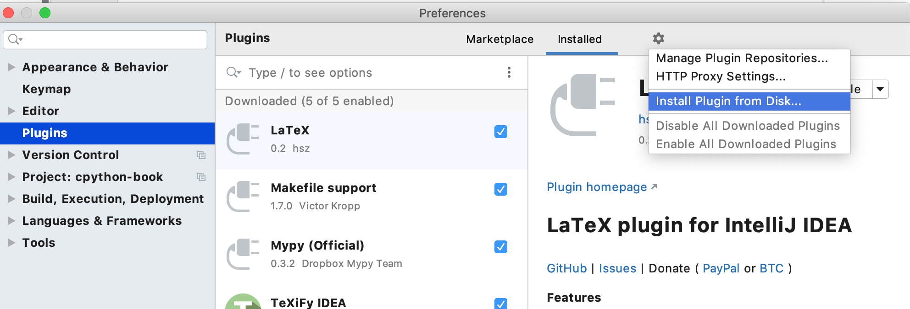

# Pycharm-Security

Pycharm-security is a plugin for Pycharm, or JetBrains IDE's with the Python module.
It looks at your Python code for common security vulnerabilities and suggests fixes.

## Installation

### Installation from marketplace

You can install the plugin on the [Jetbrains plugin marketplace](https://plugins.jetbrains.com/plugin/13609-python-security).

Plugin releases are verified by JetBrains, so there is normally a lag between a release on Github and one in the marketplace whilst the release is verified.

### Installation from GitHub

If you want to install a specific version, go to the [releases](https://github.com/tonybaloney/pycharm-security/releases) page and download the `pycharm-security-xxx.zip` file.
Inside PyCharm, 

### Installation from source

You can build from source with IntelliJ IDEA. Open this repository and run the `:buildPlugin` task. Inside `build/distributions/` will be a copy of `pycharm-security-xxx.zip`. Use the Installation from Disk instructions to complete the install

## Using the package scanner

...

## Development

This project is designed for IntelliJ IDEA and requires gradle.

Important gradle targets are:

* `:test` - Run the test suite
* `:runIde` - Start PyCharm with the plugin in debug mode
* `:jacocoTestReport` - Run test coverage
* `:verifyPlugin` - Run plugin verification before publishing
